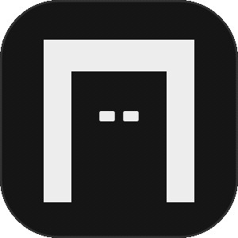

<p align="center">
  <picture>
    <source media="(prefers-color-scheme: dark)" srcset="public/logos/oxi-dark-mode.gif">
    <source media="(prefers-color-scheme: light)" srcset="public/logos/oxi-light-mode.gif">
    
  </picture>
</p>

<h1 align="center">Oxiv</h1>

<p align="center">
  <strong>High-Precision, Watermark-Free Open Media Demuxer & Streaming Protocol</strong><br>
  Stateless • Lossless Bitstream • Zero Retention • Pure Client-Side Privacy
</p>

<p align="center">
  <a href="#overview">Overview</a> •
  <a href="#architectural-principles">Architecture</a> •
  <a href="#status--platform-capabilities">Platforms</a> •
  <a href="#running-locally">Quick Start</a> •
  <a href="#project-structure">Structure</a> •
  <a href="#license">License</a>
</p>

---

## Overview

Oxiv is an open-source, stateless media parser and direct streaming downloader built for modern social platforms (TikTok, Pinterest, Facebook, and X).

Unlike conventional web downloaders, Oxiv operates without user accounts, server-side media retention, tracking cookies, or heavy browser automation frameworks. URLs are demuxed via public SSR hydration traversals and piped directly to the client browser in pristine, unaltered quality.

---

## Architectural Principles

- **100% Stateless & Edge-Ready**: No database, no user accounts, no session cookies, and no background worker queues.
- **Zero Third-Party Scraping Services**: Pure native Node.js fetching combined with AST/JSON traversal of public SSR payloads. No Puppeteer, Playwright, or paid scraping APIs.
- **Client-Side Zero-Retention**: Extraction history is retained strictly within the user's local browser storage (`localStorage`). Intermediary servers never store URLs or media payloads.
- **Direct CDN Bitstream Streaming**: An unbuffered pass-through reverse proxy streams raw media bytes directly to bypass cross-origin download limitations and hotlinking restrictions without re-encoding or quality degradation.
- **Bilingual Support**: Native English and Arabic layouts with server-side directionality (LTR/RTL) and zero layout shift.

---

## Status & Platform Capabilities

| Platform | Status | Supported Content Formats | Extractor |
| :--- | :--- | :--- | :--- |
| TikTok | Live | Watermark-free MP4, Photo Slideshows, 128kbps MP3 Audio | `lib/extractors/tiktok.ts` |
| Pinterest | Live | Original High-Res Images, 1080p MP4 Video | `lib/extractors/pinterest.ts` |
| Facebook | Live | Reels, Watch Videos, Multi-Photo PCB Posts, Full Albums, M4A Audio | `lib/extractors/facebook.ts` |
| X (Twitter) | Live | Progressive MP4 Ladder (1080p-360p), Orig Photos, Looping GIFs, Quoted Fallback | `lib/extractors/x.ts` |
| Instagram | Planned | Posts, Reels, Stories, Carousels | Pipeline Pending |
| YouTube | Planned | Shorts, Video Streams, Audio Demuxing | Pipeline Pending |

---

## Tech Stack

- **Framework**: Next.js 15 (App Router, React 19)
- **Language**: TypeScript 5 (Strict mode)
- **Styling**: Tailwind CSS 3.4 + Scoped Design Variables (Monochrome Gridlines)
- **Packaging**: `fflate` (High-performance in-memory client-side ZIP compression)
- **Icons**: `lucide-react`, `react-icons`

---

## Running Locally

### Prerequisites
- Node.js 18.18 or higher
- npm, pnpm, or yarn

### Installation

Clone the repository and install dependencies:

```bash
git clone https://github.com/xsiphr/Oxiv.git
cd Oxiv
npm install
```

Start the development server:

```bash
npm run dev
```

Open [http://localhost:3000](http://localhost:3000) in your browser.

### Production Build

To verify strict typing and generate an optimized production bundle:

```bash
npm run build
```

---

## Project Structure

```
Oxiv/
├── app/
│   ├── api/
│   │   ├── extract/route.ts       # Central POST endpoint for media demuxing
│   │   └── download/route.ts      # Unbuffered streaming reverse proxy
│   ├── about/                     # Dedicated documentation routes (Manifesto, Platforms, FAQ)
│   ├── activity/                  # Public Git commit ledger and heatmap
│   ├── recents/                   # Client-side extraction history manager
│   ├── settings/                  # Client preferences (Theme, Language, Cache)
│   ├── support/                   # Minimal support portal & mascot showcase
│   └── page.tsx                   # Main SPA downloader interface
├── components/
│   ├── media/
│   │   └── MediaPreview.tsx       # Unified video player, photo carousel, ZIP packaging
│   ├── recents/
│   │   └── RecentsContent.tsx     # Client-side history ledger with live search & filters
│   ├── ui/
│   │   ├── ExtractionInput.tsx    # Primary URL ingestion bar
│   │   ├── MegaMenu.tsx           # Monochrome Gridlines navigation popover
│   │   ├── Navbar.tsx             # Sticky header with active indicators
│   │   ├── Oxi.tsx                # Interactive geometric mascot & state machine
│   │   └── TerminalStream.tsx     # Telemetry lifecycle terminal
│   └── effects/
├── lib/
│   ├── extractors/
│   │   ├── facebook.ts            # Facebook Comet desktop SSR hydration parser
│   │   ├── pinterest.ts           # Pinterest high-res pin & video extractor
│   │   ├── tiktok.ts              # TikTok video, slideshow & MP3 extractor
│   │   └── x.ts                   # X (Twitter) syndication MP4 ladder, master photos & GIF extractor
│   ├── i18n/                      # Bilingual dictionaries (English & Arabic)
│   ├── platformRegistry.ts        # Platform matching & URL routing tier logic
│   ├── scroll.ts                  # Viewport cubic easing auto-scroll engine
│   └── zip.ts                     # In-memory browser ZIP packaging engine
└── types/
```

---

## License

This project is licensed under the **GNU Affero General Public License v3.0 (AGPL-3.0)**. See the [LICENSE](LICENSE) file for details.

---

## Contributing

Contributions, issues, and feature suggestions are welcome. Ensure all contributions follow the strict TypeScript guidelines and pass `npm run build` with zero errors before submitting pull requests.
